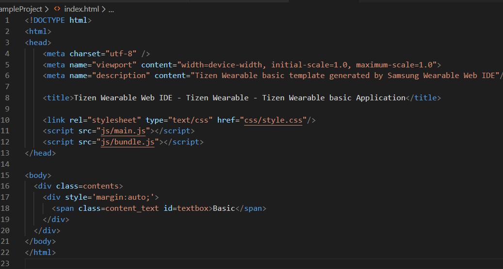

# Preparación del entorno de desarrollo Tizen

## Instalaciones requeridas
### Tizen studio
Descargar e instalar [Tizen Studio.](https://developer.tizen.org/development/tizen-studio/download)

Una vez instalado, abrir "Package Manager"
En la pestaña "Main SDK" instalar la versión de Wearable necesaria, en este caso 4.0 Wearable
Instalar también las "Tizen SDK tools"

En la pestaña "Extension SDK", instalar "Samsung Certificate Extension" (importante para desplegar nuestra aplicación)

Una vez finalizado, abrir el programa "Certificate Manager"
Crear un nuevo certificado Samsung (guía disponible en el [siguiente enlace](https://samsung.github.io/Tizen.NET/wearables/create-samsung-certificate-for-samsung-wearables/#create-a-samsung-certificate-profile))

(Nota: hace falta crear una cuenta Samsung para poder crear un certificado Samsung.)
Es importante que el certificado sea Samsung y no Tizen, puesto que este último no nos permite desplegar aplicaciones en dispositivos reales

Una vez instalado el entorno de desarrollo y creado el certificado, podemos crear el proyecto de la aplicación utilizando Tizen Studio, pero es recomendable utilizar la extensión de desarrollo para Tizen de Visual Studio Code

Guía de instalación disponible en [este enlace](https://docs.tizen.org/application/vscode-ext/web/)
Simplemente buscar "Visual Code Extension for Tizen Web" en el buscador de extensiones de Visual Studio y seguir las sugerencias de instalación.

Para poder probar nuestra aplicación, podemos utilizar un emulador de Tizen. Para ello abrimos el programa "Emulator Manager" y creamos una instancia nueva a emular. La imagen del emulador se puede descargar durante la creación de la instancia. Personalmente yo he utilizado la versión 4.0 de Tizen de un "Wearable Circle". El resto de parámetros se pueden dejar por defecto.

Todo está listo para crear nuestro proyecto. En Visual Studio Code, accedemos a la paleta de comandos (por defecto F1) y buscamos "Tizen Web: Create Wizard Project". Seguimos los pasos de instalación.

Al escoger el tipo de proyecto, podemos elegir tanto template como sample. Al escoger el perfil de la aplicación, elegimos "Wearable" y seleccionamos la versión para la que queremos programar, en nuestro caso la versión 4.0. 

Tanto si hemos escogido template como wearable, el siguiente paso será decidir qué proyecto base queremos generar. Para nuestro caso lo mejor sería elegir el template "Basic UI". 

Finalmente nombramos el proyecto y el paquete al que pertenece y presionamos "Finish". Con esto tenemos creado el esqueleto de la aplicación.

## Aplicación API en Tizen

Para empezar, la estructura básica de la aplicación se puede ver en la última imagen. El proyecto recién creado contiene un fichero config.xml, un index.html y una carpeta js donde se encuentran los scripts de nuestra aplicación.
Para integrar los archivos generados por el generador de APIs hay que realizar algunas modificaciones, las cuales se proceden a explicar.

Necesitaremos extraer estos archivos del zip con nuestra API generada, y debemos añadirlos a la carpeta base de nuestro proyecto tizen. El archivo "index.js" podemos añadirlo a la carpeta js.

A continuación es necesario que instalemos las dependencias de npm. Para ello abrimos una consola de comandos, navegamos hasta la raíz del proyecto y utilizamos "npm install".

Una vez instalados todos los paquetes, también debemos añadir ["browserify"](http://browserify.org/), ya que nos permitirá consolidar todos los archivos de nuestra aplicación en un solo fichero javascript en el que se encuentren todas las dependencias para que la aplicación funcione correctamente en el reloj. Para ello podemos utilizar el siguiente comando npm: 

Una vez tenemos instalado browserify, debemos crear un bundle.js que contenga todas las dependencias de node incluidas, ya que el reloj no puede acceder a las bibliotecas de node por sí mismo. Para ello, utilizamos el siguiente comando desde consola:

Una vez creado el bundle, nuestros dos archivos javascript importantes son "main.js", el cual contiene el funcionamiento básico de una aplicación Tizen y nos permite interactuar con la interfaz, y el "bundle.js" donde tenemos el funcionamiento de nuestra aplicación de APIs.
En el fichero index.html, debemos especificar qué scripts queremos utilizar en nuestra aplicación, igual que una aplicación web corriente.

Añadimos nuestro bundle.js (podemos dejar main.js para tener una interfaz en la aplicación)

## nota: Hay que cambiar la api para que utilice mqtt en lugar de http

Tenemos que instalar también [MQTT.js](https://github.com/mqttjs/MQTT.js). Se puede hacer de forma sencilla utilizando npm, mediante `npm install mqtt --save`

Antes de ejecutar nuestra aplicación, dado que vamos a necesitar acceso a internet para el envío de mensajes, debemos declarar que nuestra aplicación necesita el privilegio de internet. Para ello, añadimos la siguiente línea en el fichero config.xml:

# Compilación y despliegue

Una vez tenemos nuestra aplicación lista para probarla, necesitaremos compilarla y generar un paquete de instalación. También necesitaremos un dipositivo, ya sea real o emulado, donde desplegarla.

## dispositivo real
Necesitamos un reloj Samsung conectado a la misma red wifi que el dispositivo que estamos utilizando para el desarrollo. Una vez conectado, debemos obtener la IP del reloj.

Abrimos el programa "Device Manager" de tizen studio, y pulsamos en el botón "Remote Device Manager". Pulsamos en el botón + para añadir un nuevo dispositivo, dándole un nombre e introduciendo la IP que obtuvimos antes. El puerto se puede dejar por defecto. Una vez añadido, pulsamos en el botón OFF para cambiar a ON e iniciar la conexión.

## dispositivo emulado
Abrimos el programa "Emulator Manager" de Tizen Studio. Si no lo hemos hecho anteriormente, creamos un nuevo dispositivo "Wearable Circle". Una vez tenemos nuestro dispositivo creado, lo seleccionamos y presionamos el botón Launch. Aparecerá una ventana con forma de reloj wearable, emulando la funcionalidad de un dispositivo real.

Independientemente de si utilizamos un dispositivo real o emulado, el proceso es el mismo. Primero, en Visual Studio Code accedemos a la paleta de comandos con F1 y buscamos "Tizen Web: Build Tizen App". Seleccionamos nuestro proyecto y esperamos a que se compile y se genere el paquete desplegable. Este proceso puede tardar varios minutos.

Tras finalizar la creación del paquete, volvemos a abrir la paleta de comandos y buscamos "Tizen Web: Install Tizen App". Automáticamente se desplegará el paquete en el emulador o dispositivo que tengamos conectado.

Una vez desplegada la aplicación, si queremos realizar debugging, podemos buscar "Tizen Web: Debugg Tizen App" en la paleta de comandos, lo cual abrirá un navegador donde podemos acceder a consola y recibir mensajes de error como si fuese una aplicación web.